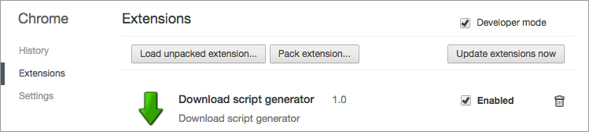
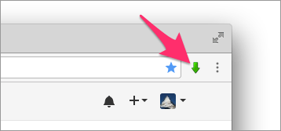
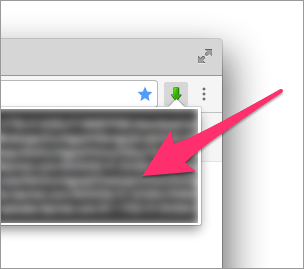

# download-chrome-extension

A Chrome extension to generate download script

## Setup

Replace ```TARGET_SITE_URL_PREFIX``` to a URL prefix of your target site in ```js/config.js```.

```
const config = {
	url: 'http://TARGET_SITE_URL_PREFIX/'
};
```

## Usage

Install the extension (Access to chrome://extensions/)



Click the green arrow



Select and copy generated script



And paste to Terminal.app
